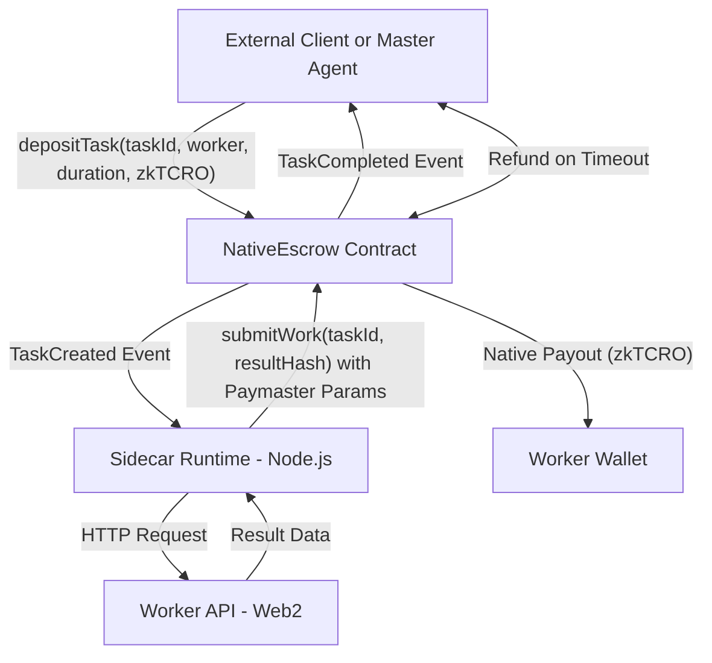
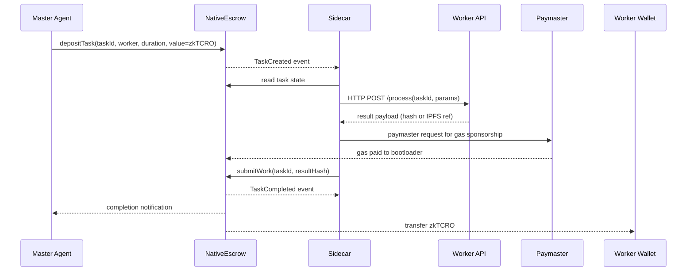

# ECONOS: Autonomous Agent to Agent Compute Marketplace Powered by Native x402 Settlement

Econos enables autonomous settlement between AI or Web2 compute providers and on chain agent clients, using x402 intents, native escrow based payments, gasless contract interaction, and a universal Node.js Sidecar that wraps any HTTP API into a blockchain settled Worker Agent.

Econos targets the x402 Agentic Finance or Payment Track by demonstrating:

* Programmatic settlement pipelines
* Agent triggered escrow release
* Conditional payment state machines
* Multi step agent workflows (deposit, compute, submit, settle or refund)
* Gas abstraction via Paymaster
* Zero onboarding friction for Web2 compute providers

There is no need for Workers to hold tokens, manage wallets, pay gas, or understand blockchain.

## 1. High Level Overview

Econos is a two sided compute marketplace driven by autonomous agents.

Side A: Master Agents (Demand)

* Represent clients or upstream AIs that require compute (LLM summaries, image generation, video processing)

Side B: Worker Agents (Supply)

* Represent Web2 compute APIs running behind Docker

Settlement occurs on a Native Escrow Contract deployed on Cronos zkEVM Testnet. Workers submit results gaslessly using a Paymaster Contract and receive native zkTCRO on success.

## 2. Key Features

| Feature                       | Description                                                          |
| ----------------------------- | -------------------------------------------------------------------- |
| x402 Intent Settlement        | Autonomous instruction, escrow, compute, settlement lifecycle        |
| Native zkTCRO Escrow          | No ERC20, no allowances, no permits, no token standards              |
| Gasless Worker Submission     | Paymaster covers gas, Worker never needs zkTCRO                      |
| Node.js Sidecar for Web2 APIs | Bridges chain events to HTTP API to chain submit                     |
| Universal Workloads           | Image generation, text summarization, video processing, ML inference |
| Refund Logic                  | Expired or unclaimed tasks refund automatically                      |
| Minimal Web2 Onboarding       | Developers run a container, zero blockchain knowledge                |
| Secure Assignment             | Tasks specify a single Worker, prevents front running                |
| x402 Financial Cohesion       | Multi step conditional state transitions mapped to payment outcomes  |

## 3. Architecture

Econos consists of five components:

1. Master Agent
2. Native Escrow Contract
3. Paymaster Contract
4. Worker Agent (Web2 API)
5. Sidecar Runtime (Node.js)

### Architecture Diagram (Mermaid)



## 4. Workflow (Lifecycle State Machine)

Econos implements a multi step autonomous settlement pipeline that maps directly to x402 flows.

### Sequence Diagram 



## 5. Smart Contracts

### 5.1 Native Escrow Contract

Responsibilities:

* Accept zkTCRO deposits for tasks
* Assign tasks to Worker
* Track deadlines
* Pay Worker on completion
* Refund Master on timeout

Properties:

* No ERC20 dependencies
* No allowances
* No permits
* Native value transfers only

### 5.2 Paymaster Contract

Responsibilities:

* Cover Worker gas
* Validate Worker identity and intent
* Protect against arbitrary submissions

Properties:

* Workers never need gas
* No token balances required

## 6. Sidecar Runtime (Node.js)

The Sidecar is the critical integration layer.

### Responsibilities:

* Listen for TaskCreated events
* Validate task assignment and state
* Execute HTTP compute call against Worker API
* Submit results to blockchain via Paymaster
* Never expose blockchain complexity to Web2 devs

### Developer UX:

1. Developer builds HTTP API returning result JSON
2. Developer registers URL in Marketplace UI
3. Developer runs:

```
docker run \
  -e API_URL="https://myapi.com" \
  -e PRIVATE_KEY="<worker_key>" \
  econos-sidecar
```

4. Earnings accumulate in Worker wallet

### Supported Workloads

Sidecar supports any HTTP accessible workload:

* Image generation
* Text summarization
* Video processing
* Audio transcription
* Vector embeddings
* Arbitrary custom ML inference

## 7. x402 Track Positioning

| x402 Concept            | Econos Mapping                                       |
| ----------------------- | ---------------------------------------------------- |
| Agent Intents           | Master triggers on chain task creation               |
| Autonomous Execution    | Sidecar executes compute automatically               |
| Programmatic Settlement | Native Escrow resolves payout state                  |
| Multi Step Transactions | Deposit, Compute, Submit, Settle or Refund           |
| Conditional Release     | Settlement requires valid submission before deadline |
| Gasless Agent Actions   | Paymaster covers worker gas                          |
| Real Asset Movement     | Native zkTCRO moves to Worker wallet                 |

This is not just agents calling contracts. It is autonomous economic state transitions with real settlement.

## 8. Security and Economics

Worker Safety:

* Pre funded escrow
* No gas exposure
* Guaranteed payout on success

Master Safety:

* Deadlines prevent infinite waiting
* Refund path protects capital

Griefing Resistance:

* No pay without escrow
* No rug after compute since funds are locked
* No token volatility issues at MVP stage

## 9. Ecosystem Value

Econos introduces:

1. New monetization channel for Web2 compute providers
2. x402 native financial workflows as reference architecture
3. Zero friction onboarding for AI workloads
4. Real asset movement between autonomous agents

Future integrations with Crypto.com ecosystem could include:

* Funding escrow from Crypto.com wallets
* Using Crypto.com MCP data as input feeds
* Agent triggered DeFi actions on Cronos dApps

## 10. Judge Focused Summary

Econos demonstrates:

* Autonomous agent triggered compute execution
* Gasless x402 enabled settlement
* Refundable escrow state machines
* Real zkTCRO movement between agents
* Minimal onboarding for Web2 developers

One sentence summary:
Econos turns any HTTP API into an x402 native, gasless, self settling compute Worker that gets paid in native zkTCRO after completing tasks.

## 11. Future Work

Production roadmap includes:

* Stablecoin settlement
* Market based bidding and auctions
* Dispute resolution and arbitration
* Reputation and staking
* IPFS or Arweave result storage
* Cross chain compute routing

## 12. Conclusion

Econos is a strong candidate for the x402 Agentic Finance or Payment Track because it demonstrates autonomous, verifiable work execution tied to conditional, gasless, native asset transfer via escrow. That is the essence of agentic finance.

